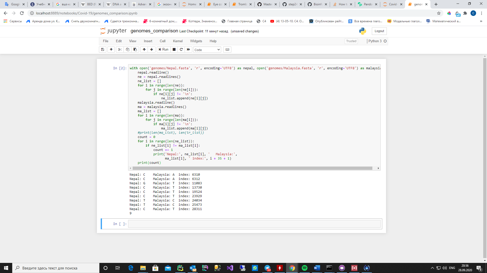

# Covid-19 spread analysis.
- Отсюда взял 10 геномов, включая SARS-COV-1 и Уханьский геном SARS-COV-2 (остальные SARS-COV-2):
https://www.ncbi.nlm.nih.gov/labs/virus/vssi/#/virus?SeqType_s=Nucleotide&VirusLineage_ss=SARS-CoV-2,%20taxid:2697049
- Построил выравнивание методом ClustalW:

 
- Построил филогенетическое дерево методом расстояний
- Ввиду малого количества мутаций в геномах вирусов дерево имеет малоразличимую структуру, поэтому воспользуемся матрицей расстояний (на 3 скрине)
 

Ввиду географических фактор и знания о том, что вспышка коронавируса была в Ухане, Китай, можно предположить, что вторым по происхождению после Sars-cov (1) был Уханьский Sars-cov-2.
Согласно данным матрицы расстояний самым ближним по происхождению после Уханьского коронавируса был геном коронавируса из Непала, последним геном коронавируса из Малайзии.
То есть человека, который приобрёл коронавирус с генотипом MT072688, приобрёл его раньше всех (из представленных генотипов) после заражённого в Ухане. 
Человек. Который приобрёл коронавирус с генотипом MT372480, приобрёл его позже всех после заражённого в Ухане
 

Рассмотрев множественные выравнивания, я пришёл к выводу – чтобы сравнить два генома, надо убрать из Непальского 20 первых нуклеотидов. Это делается, чтобы при попарном сравнении координаты не поплыли.
- После этого я написал скрипт на питоне для поиска различий в нуклеотидах между двумя этими геномами вирусов:

- Возьмём первые 5 для анализа и сопоставление мутаций местам в геноме, используя разметку Уханьского генома.
- Чтобы перевести координаты найденных мутаций, прибавим разницу в нуклеотидах согласно множественному выравниванию (+35 и +1 так как, в питоне индексы начинаются с нуля – надо перевести в позиции в разметке генома: это прописано в скрипте).
Данные по местам мутаций в геноме:
1.	Мутация C/A: ген - orf1a polyprotein/ orf1ab polyprotein
2.	Мутация C/A: ген - orf1a polyprotein/ orf1ab polyprotein
3.	Мутация G/T: ген - orf1a polyprotein/ orf1ab polyprotein
4.	Мутация C/T: ген - orf1ab polyprotein
5.	Мутация C/T: ген - orf1ab polyprotein

