# Сравнение точности определения мотивов транскриционного фактора MAFF различными сервисами и программными пакетами.
Транскрипционный фактор в виде файла bed (narrowpeak) загружен с https://www.encodeproject.org/search/?type=Experiment&status=released  

В каждой строке прописаны регионы человеческого генома, обогащённые данным транскриционным фактором.
- Сортировка bed файла с наилучшими q-value, выборка топ 1000, сохранение в fasta формате:
 

 
Factorbook:

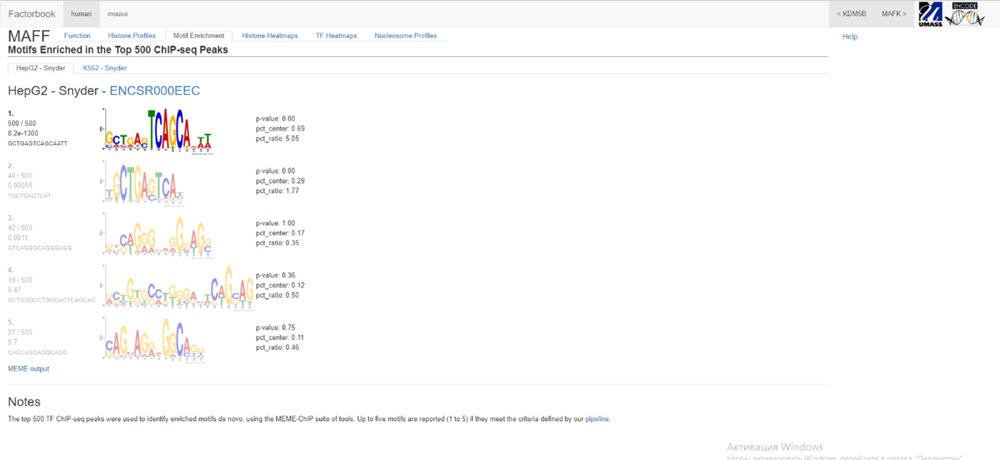

Jaspar:
 
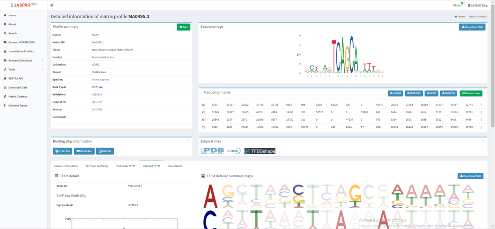
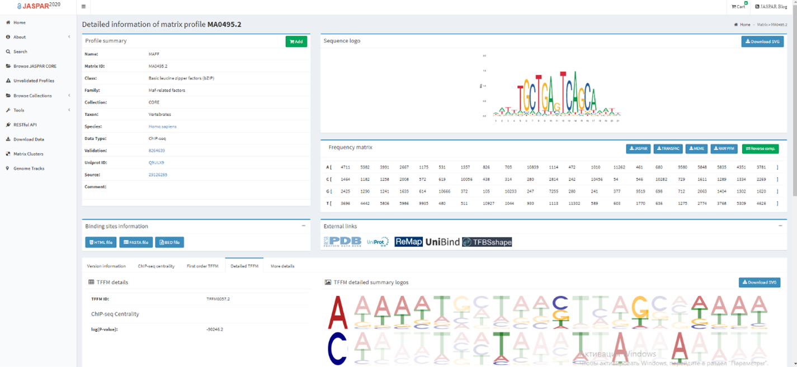
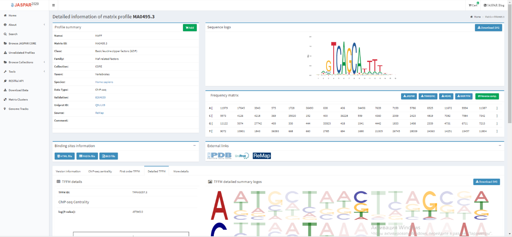
 
Сгенерированный background с сохранение тринуклеотидов:
 

RSAT (с программным background):
 
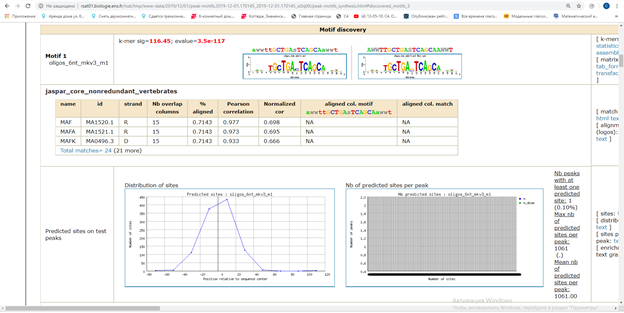
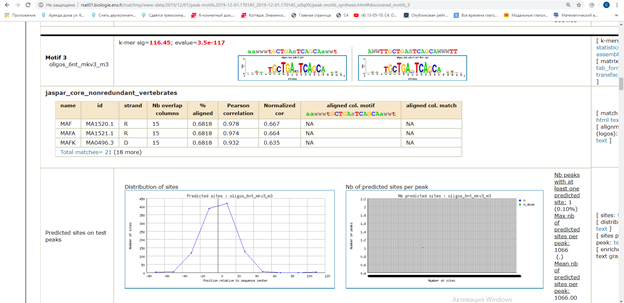
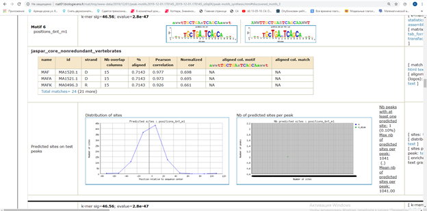
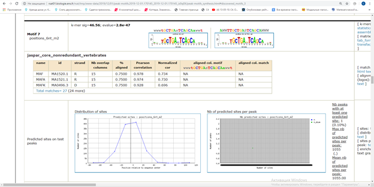
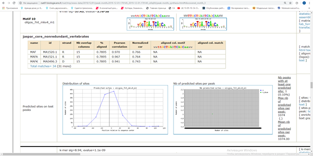
 
 
RSAT (со сгенерированным background)
 
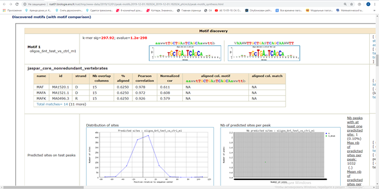
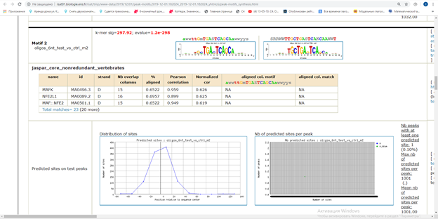
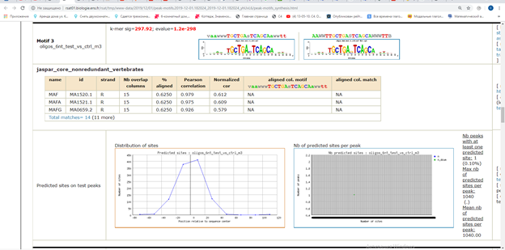
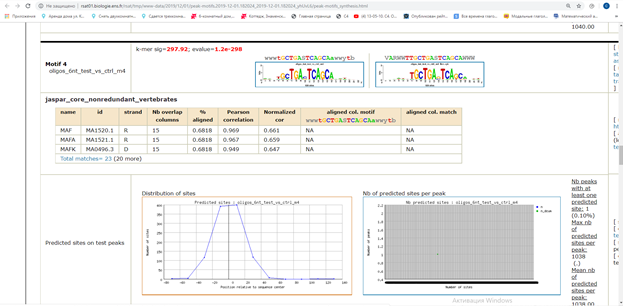
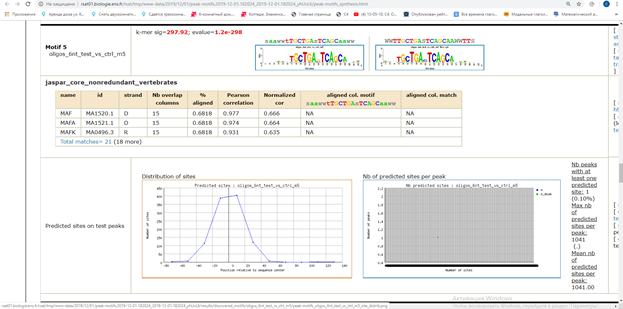

 
Унификация названия последовательностей в fasta файле для MEME (иначе не принимает):
+ применение алгоритма цепей Маркова для преобразования бэкграунда (иначе MEME не принимает):

(последняя подчеркнутая строчка относится к алгоритму Homer)
MEME-chip (с программным BG)

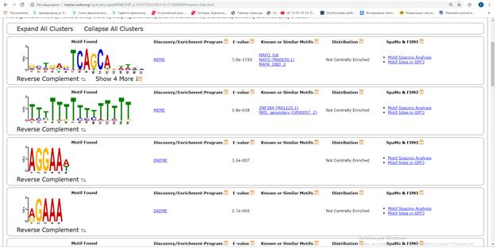
 
MEME-chip (со сгенерированным бг)

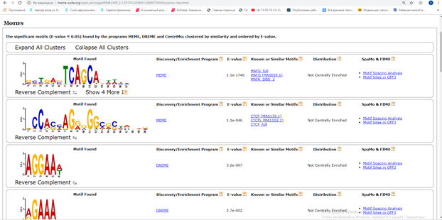

Homer (с программным BG):

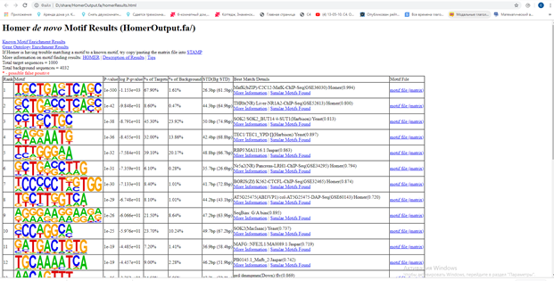

Homer (со сгенерированным BG):

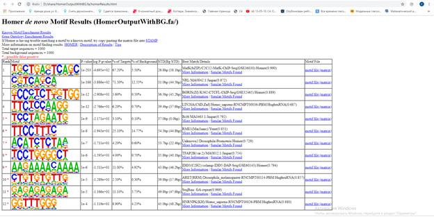

Вывод:
Наилучшим образом с поиском мотивов справился RSAT с предоставленным программой бэкграундом. Это можно понять исходя из того, что у него больше всего найденных мотивов подходит к мотивам в Jaspar и Factorbook. Основные схожести по таким мотивам как: “*tcagca*”, “*tgctga**tcagca*”
Хуже всех справился Homer, так как с любыми бэкграундами нашёл только по одному мотиву и то, основная его часть (по частоте) не до конца совпадает по первому нуклеотиду.
Также у RSAT числа e-value более приближенные к Factorbook и Jaspar.

