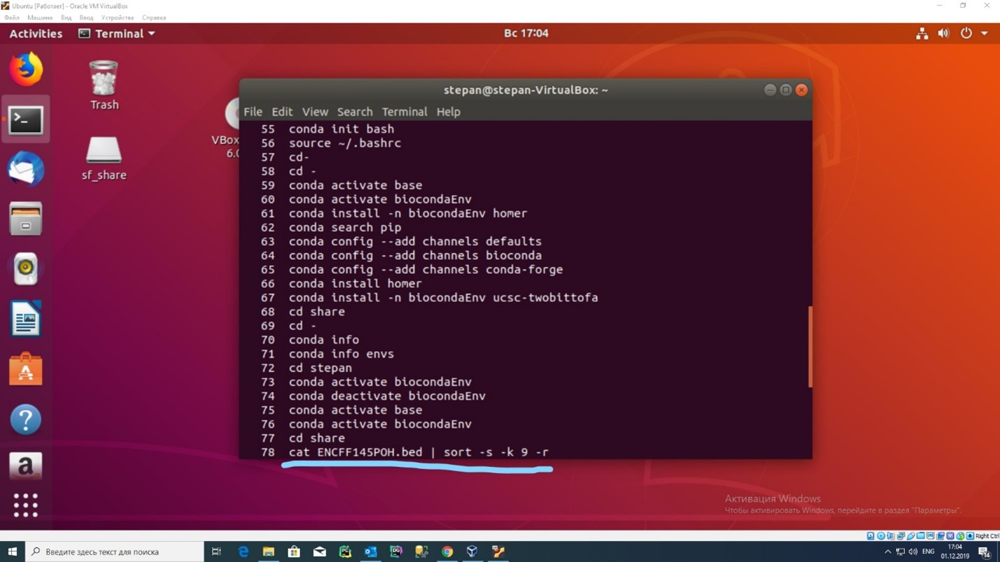
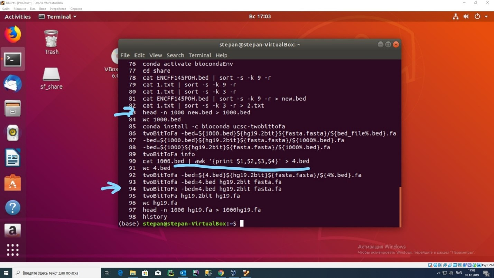
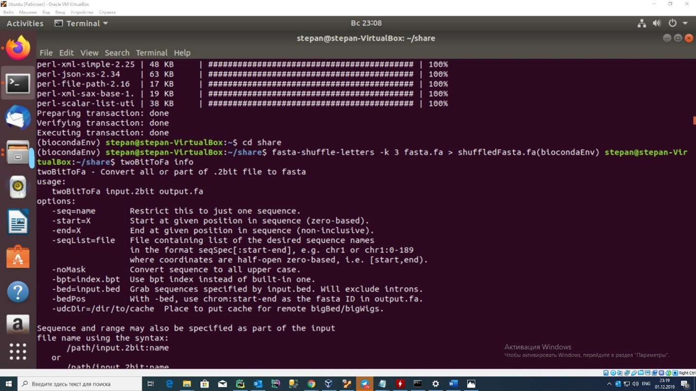
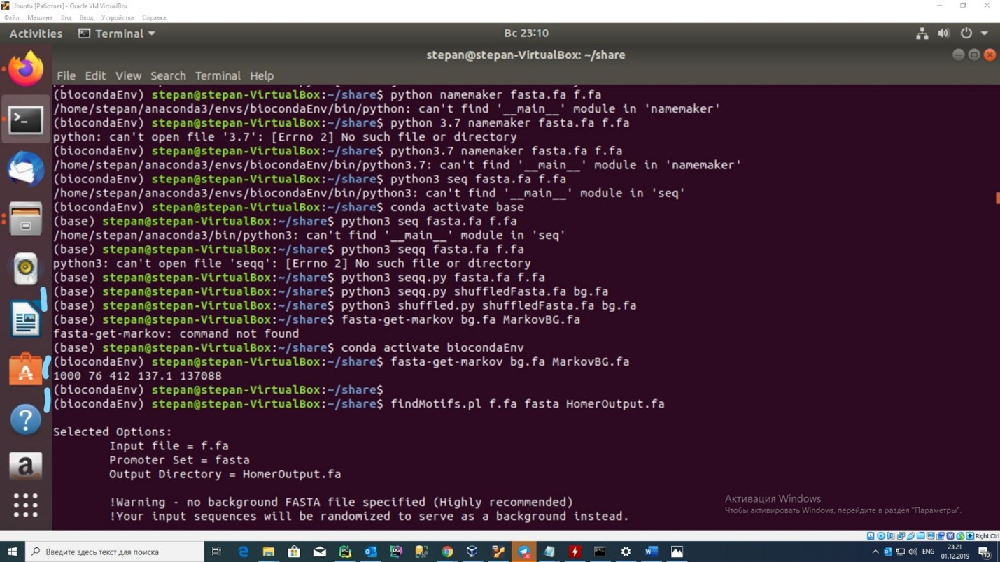

# Сравнение точности определения мотивов транскриционного фактора MAFF различными сервисами и программными пакетами.
Транскрипционный фактор в виде файла bed (narrowpeak) загружен с https://www.encodeproject.org/search/?type=Experiment&status=released  

В каждой строке прописаны регионы человеческого генома, обогащённые данным транскриционным фактором.
- Сортировка bed файла с наилучшими q-value, выборка топ 1000, сохранение в fasta формате:
 

## Лучшие мотивы транскрипционного фактора по разным интернет-ресурсам

- Factorbook:

- Jaspar:
 

## Генерация background-последовательности 
> далее BG - рандомная последовательность на основе исходной с сохранением частот элементов  

Сгенерированный BG с сохранением тринуклеотидов:
 

## Поиск мотивов в RSAT peak-motif
C программным BG:
 

 
Cо сгенерированным BG:
 

## Поиск мотивов в MEME-ChIP
Для использования данных в данном программном продукте необходимо:
- Унификация названия последовательностей в fasta файле для MEME-ChIP (иначе не принимает, использую скрипт генерации уникальных имён "namemaker")
- Применение алгоритма на основе цепей Маркова для преобразования BG (иначе MEME-ChIP не принимает)  
> Алгоритм на основе цепей Маркова обеспечивает генерацию новой рандомной последовательности,  
> используя статистические данные о частоте переходов из одного нуклеотида в другой

> последняя подчеркнутая строчка относится к алгоритму Homer, который мы рассмотрим далее  

MEME-chip с программным BG:

 
MEME-chip со сгенерированным BG:

## Поиск мотивов в Homer
> Алгоритм представлен только на MacOS, UNIX
С программным BG:

Со сгенерированным BG:

## Вывод:
Наилучшим образом с поиском мотивов справился RSAT peak-motif с предоставленным программой бэкграундом. Это можно понять исходя из того, что у него больше всего найденных мотивов подходит к мотивам в Jaspar и Factorbook. Основные схожести по таким мотивам как: “*tcagca*”, “*tgctga\**tcagca*”.  

Хуже всех справился Homer, так как с любыми бэкграундами нашёл только по одному мотиву и то, основная его часть (по частоте) не до конца совпадает по первому нуклеотиду.
Также у RSAT peak-motif числа e-value более приближенные к Factorbook и Jaspar.

