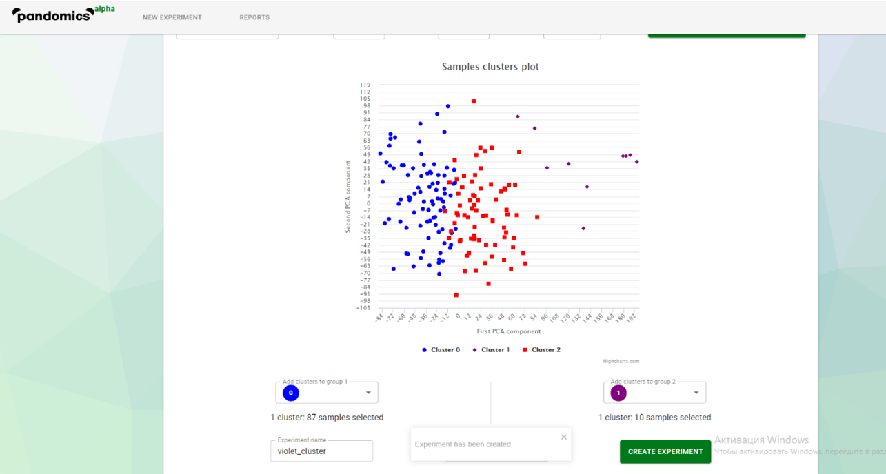
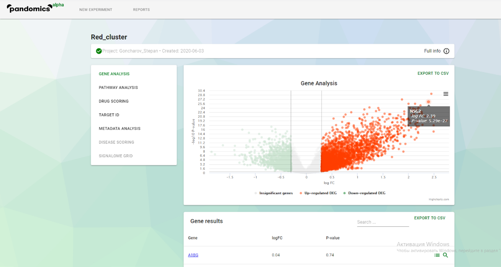
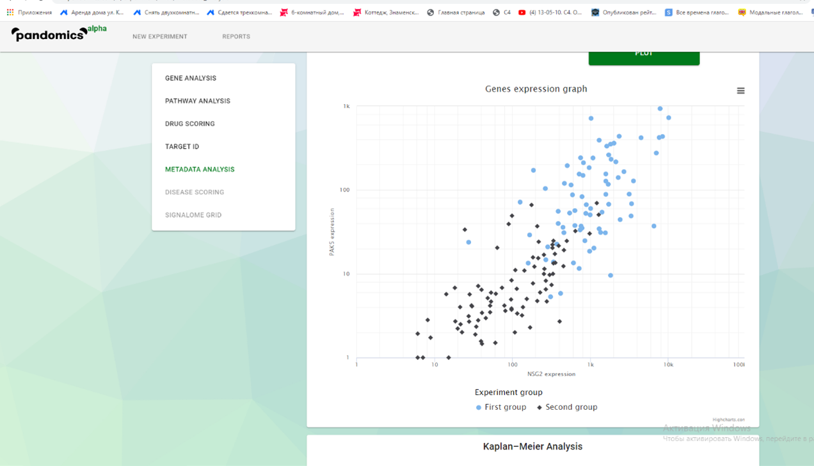

# Заболевание TCGA-GBM
Мультиформная глиобластóма — наиболее частая и наиболее агрессивная форма опухоли мозга, которая составляет до 52 % первичных опухолей мозга и до 20 % всех внутричерепных опухолей.

3) Отобрал 172 образца включая нормальные
4) Метод главных компонент (PCA) понижения размерности наиболее интересный результат показал по метаданным Treatment – наилучшая кластеризация

 
Ввиду того, что химиотерапия и иммунотерапия представлены только одним образцом каждый метод лечения, я убрал их конечного набора данных.
Оставил гормональную и лучевую терапию, как наиболее представленные методы в выборке.
И наиболее кластеризованные на этапе понижения размерности.
5) Кластеризация:
Настройки: количество итераций 300, кластеров 3, PCA-компонент 50 (самая чёткая кластеризация)

К синей группе ассоциирую образцы с гормональной терапией, к красной и фиолетовой разные наборы образцов лучевой.
6) Создал два эксперимента red_cluster и violet_cluster, сравнения синего кластера с остальными – гормональная с двумя наборами образцов, в которых применялась лучевая терапия.
7,8,9)
Эксперимент red_cluster
Выявил два гена с наибольшей дифференциальной экспрессией и статистической значимостью:
PAK5, NSG2
 

Metadata analysis 
PAK5 and NSG2

 
Взяв во внимание то, что наибольший уровень экспрессии этих генов говорит о наличии заболевания у пациентов и соответственно их степени тяжести, посмотрев на график сверху можно прийти к выводу, что у первой группы (ассоциированной с гормональной терапией) уровень экспрессии генов при заболевании выше, что можно говорить о зависимости методов лечения и результата лечения.

PAK5

Этот график показывает, что в первой группе уровень экспрессии гена PAK5 выше.
NSG2

С NSG2 такая же история.

Эксперимент violet_cluster
Выявил два гена с наибольшей дифференциальная экспрессией и статистической значимостью:
HTR3B, FADS6

Metadata analysis
HTR3B and FADS6

 
В данном эксперименте образцы очень чётко разделились на два кластера у первой группы уровень экспрессии генов, сильно дифференцируемых по экспрессии у больных, выше.
HTR3B

Этот график также показывает, как и в первом эксперименте, что у первой группы уровень экспрессии генов выше в среднем.

 
Этот график показывает, что у образцов с более высоким уровнем экспрессии гена HTR3B выше уровень смертности.

При этом мужчины подвержены большему риску смерти от этой болезни.
 

Этот график показывает, что в независимости от возраста у первой группы уровень гена HTR3B выше в среднем. Следовательно возраст никак не коррелирует с протеканием болезни, и нет особой связи между возрастом и уровнем смертности.
 

Этот график также подтверждает информацию о том, что в независимости от возраста смертность при повышенном уровне HTR3B выше. Также стоит отметить, что все графики с генами этого эксперимента и возрастом по оси абсцисс показывают, что мультиформная глиобластома раковое заболевание, в зоне риска которого находятся в основном люди преклонного возраста. 

FADS6

Этот график также показывает корреляцию между уровнем экспрессии гена, в этом случае FADS6 и группой (приближенным к типам лечения болезни)

 
Однако в случае этого гена корреляция со смертностью уже не такая большая.

Этот график Каплана-Майера показывает зависимость между уровнем выживаемости и методом лечения.
Вывод
В целом можно заключить, что гормональная терапия более эффективна нежели лучевая при лечении опухли мозга. Не все, но многие графики показывают зависимость между смертностью и типом лечения, или же смертностью и уровнем экспрессии одного из представленных генов, и уровнем экспрессии гена и типом лечения – соответственно можно сделать выводы, о том, что терапии имеют при лечении данного заболевания разные уровни эффективности. В случае недостатка сильных зависимостей при анализе генов можно сослаться на недостаточно чёткую кластеризацию и предположить, что выводы верны статистически.
Относительно функции генов
PAK5 Белок, кодируемый этим геном, является членом семейства протеинкиназ Ser / Thr PAK. Известно, что члены семейства PAK являются эффекторами Rac / Cdc42 GTPases, которые участвуют в регуляции динамики цитоскелета, пролиферации и передачи сигналов выживания клеток. Эта киназа содержит мотив интерактивного связывания CDC42 / Rac1 (CRIB), и было показано, что она связывает CDC42 в присутствии GTP. Эта киназа преимущественно экспрессируется в мозге. Он способен стимулировать рост нейритов и, следовательно, может играть роль в развитии нейритов.
NSG2 представляется критическим для формирования и / или поддержания возбуждающего синапса
HTR3B кодирует субъединицу B рецептора типа 3 для 5-гидрокситриптамина (серотонина), биогенного гормона, который функционирует как нейромедиатор, гормон и митоген. Этот рецептор вызывает быстрые деполяризующие реакции в нейронах после активации.
FADS6. Этот белок участвует в метаболизме жирных кислот, который является частью метаболизма липидов. Можно предположить, что менее задействован, чем гены, представленные выше ввиду того, что они играют ключевую роль в формировании и функционировании клеток мозга и представлены преимущественно в мозге, а этот белок имеет более общее назначение. Тем самым можно объяснить его наименьшую корреляцию между уровнем его экспрессии эффективностью терапий. 

