# Phenotype analysis
**Genotype** 

Источник: https://www.opensnp.org/genotypes  

User: indigolotus2@outlook.com  

ID: 7746  

> file 7746.ancestry.txt contains genotype  

## Анализ/предсказание цвета глаз по генотипу данного индивида
- Отфильтровал генотип по нужным снипам, проставил соответствующие значения, получил результат, что наиболее вероятный цвет глаз - голубой.
> Использовал: https://hirisplex.erasmusmc.nl
 
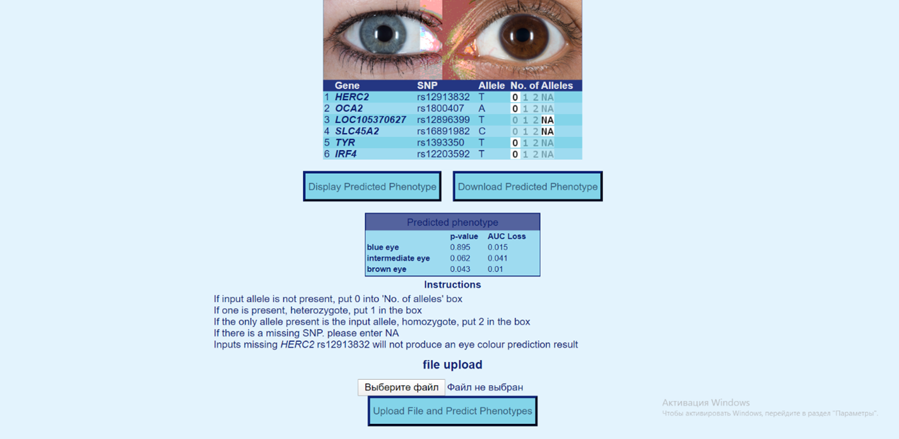
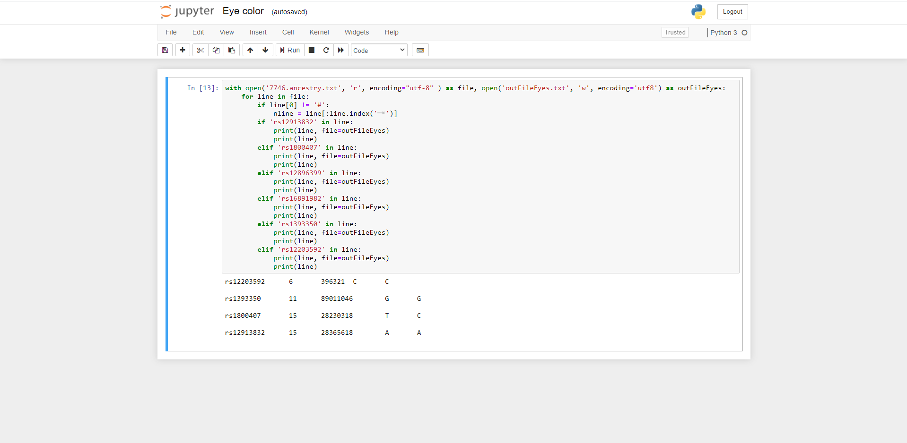

## Анализ риска тромбоза у индивида с данным генотипом
- Для выявления риска тромбоза использовал метод The 5-SNP risk allele distribution in patients with venous thrombosis and control subjects and corresponding ORs
> Использовал: https://ashpublications.org/blood/article-lookup/doi/10.1182/blood-2011-12-397752

- Отобрал нужные (ассоциированные) снипы из генотипа:

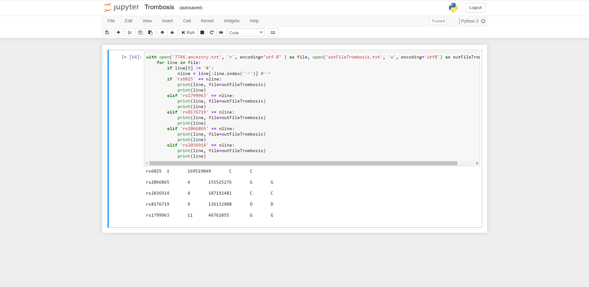
 
### 1.	Снип rs6025:
Ввиду того, что файл моего генотипа построен по положительному стренду, так как компания 23andme все файлы так форматирует, а в snpedia он отрицательный, меняя нуклеотиды в связи со сменой стренда прихожу к выводу, что в данном снипе у генотипа аллели GG – не рисковые.

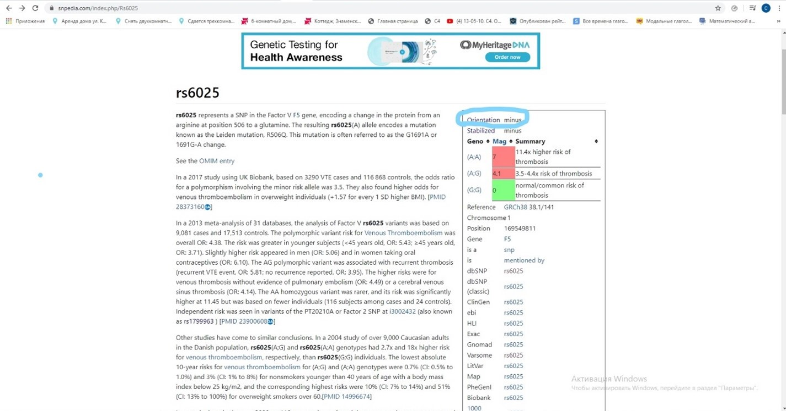

### 2.	Снип rs2066865:
В Snpedia не нашёл данных, по ссылке на статью в NCBI нашёл информацию о том, что мои аллели не рисковые (так как у меня GG, а не ТТ)

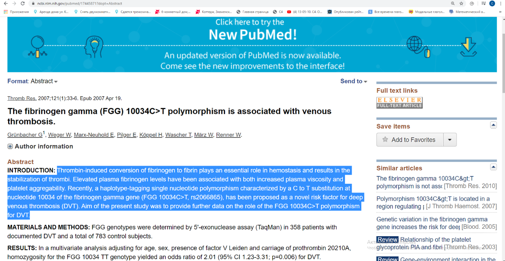

Ниже ещё одна статья, нашёл при поиске в интернете
 
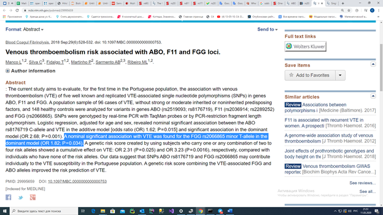

### 3.	Снип rs2036914:
Нашёл по ссылке на статью из Snpedia (на Snpedia не было информации), что мои аллели СС рисковые.
 
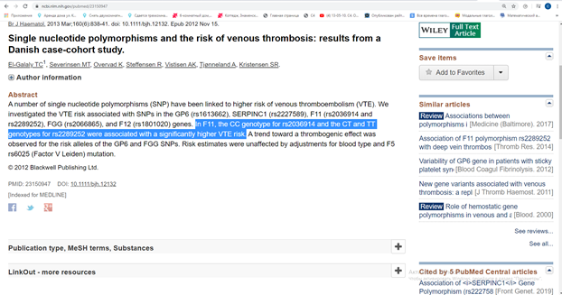

### 4.	Снип rs8176719:
На snpedia нашёл информацию, о том, что мои аллели DD (две делеции) ассоциированы с типом крови "О".
 
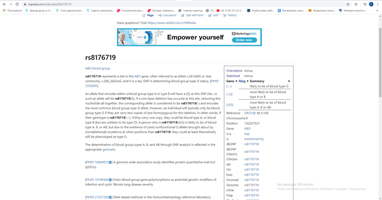

При поиске в интернете нашёл статью о том, что у людей типом крови отличным от "О" повышенный риск тромбоза (VTE) -> мои аллели не рисковые
https://www.ncbi.nlm.nih.gov/pmc/articles/PMC5338014/

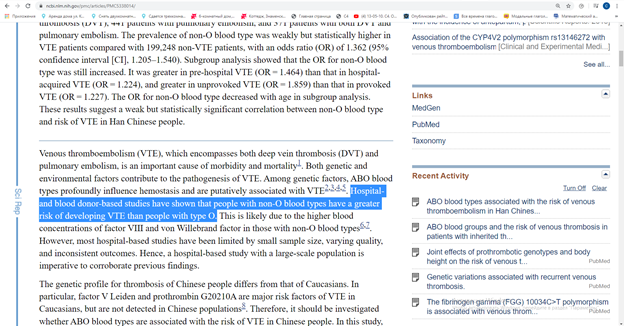

### 5.	Снип rs1799963
В Snpedia мои аллеи на таком же положительном стренде дают результат – не рисковые аллели.
 
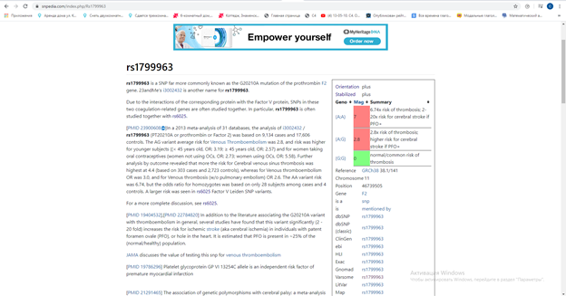

Итого 2 рисковые аллели.
По статье, приведённой выше, и таблице оттуда могу сделать вывод, что приведённый мой генотип не имеет повышенного риск тромбоза (среднестатистический риск):
 
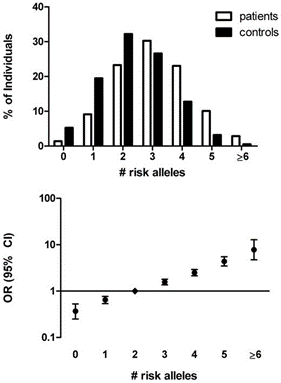

## Анализ генотипа с точки зрения разных ассоциированных снипов
### Снип	Rs1815739:
Данный снип ассоциирован с мышечной выносливостью. У представленного мной генотипа аллели СС на положительном стренде согласно Snpedia говорят о том, что у него выносливые мышцы и предрасположенность к спринтам, лёгкой атлетике.
 
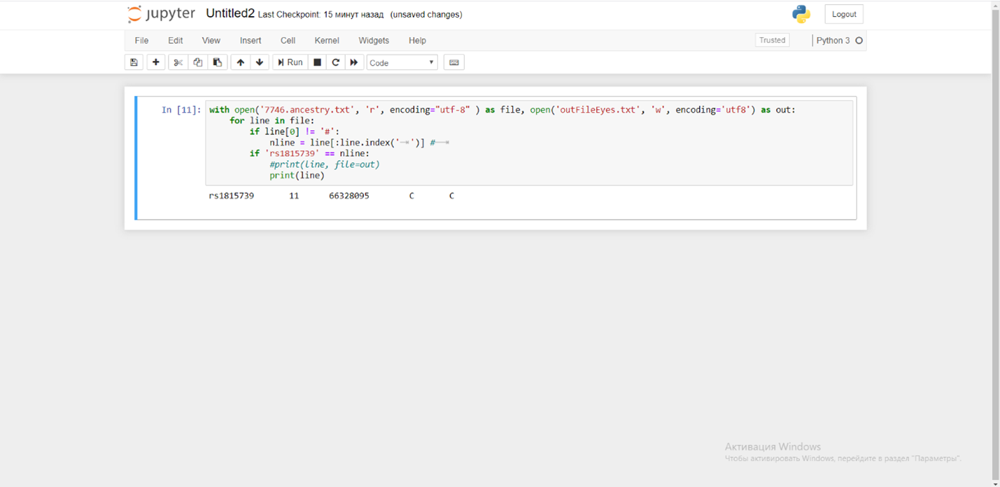
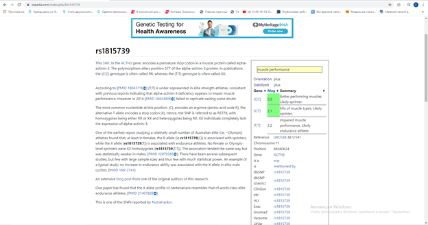

### Снип rs1800497:
Данный снип отвечает за рецептор допамина, влияет на чувство наслаждения:
У моего генотипа нормальный уровень по данным Snpedia (тут на Snpedia стренд отрицательный, переворачиваем получаем CC – совпадение, нормальный уровень).
 
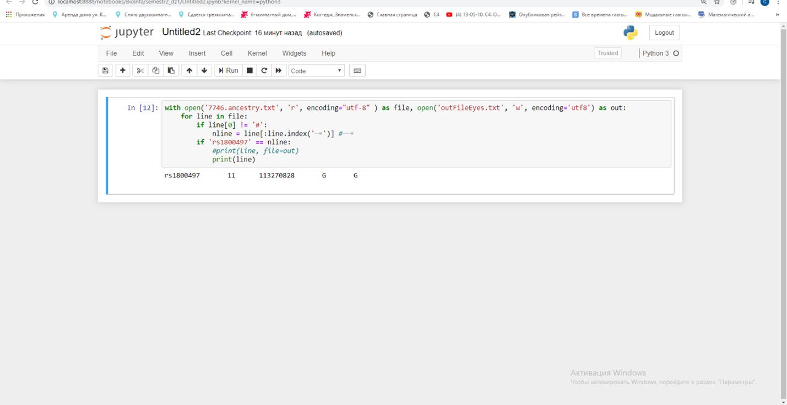
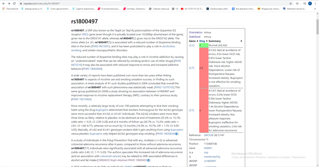
 
### Снип rs1799971:
Данный снип отвечает за ассоциацию с тягой к алкоголю.
На положительном стренде говорит о том, что человек с представленным мной генотипом предрасположен к тяге к алкоголю (AG), также есть информация о продуктивности лечения этого налтрексоном.
 
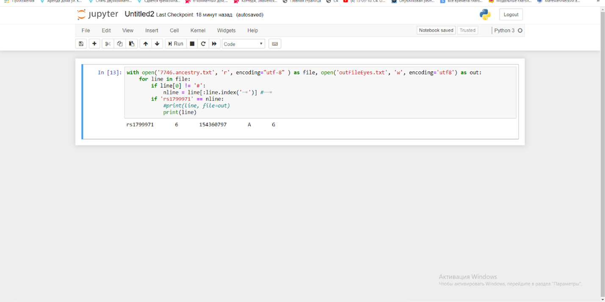
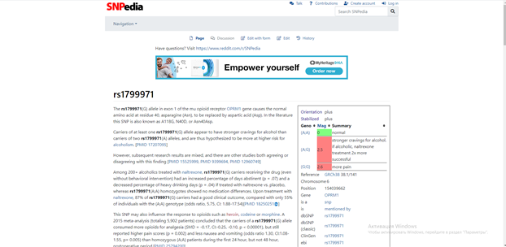
 
