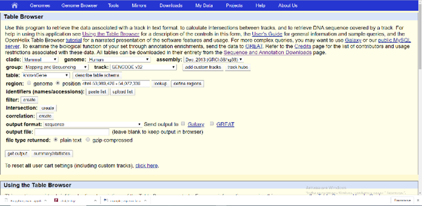
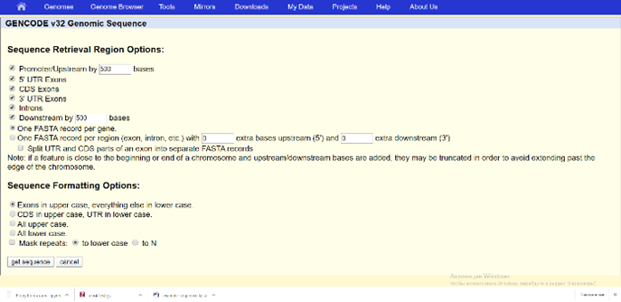
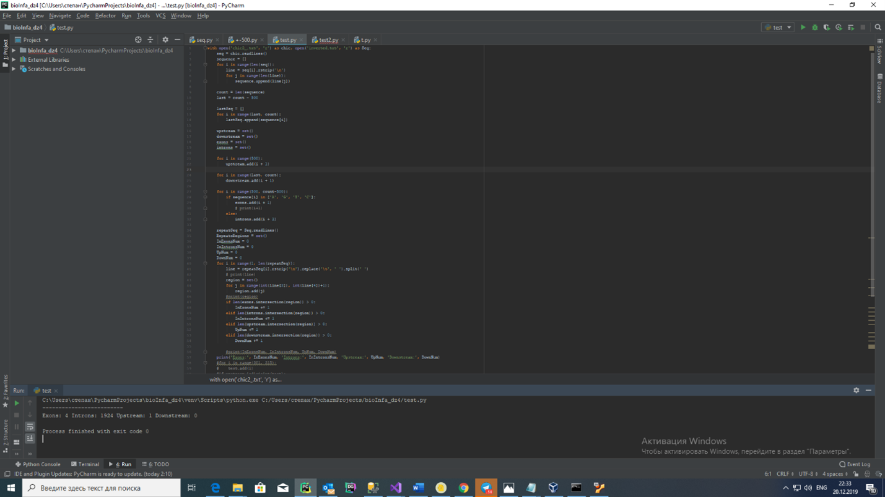
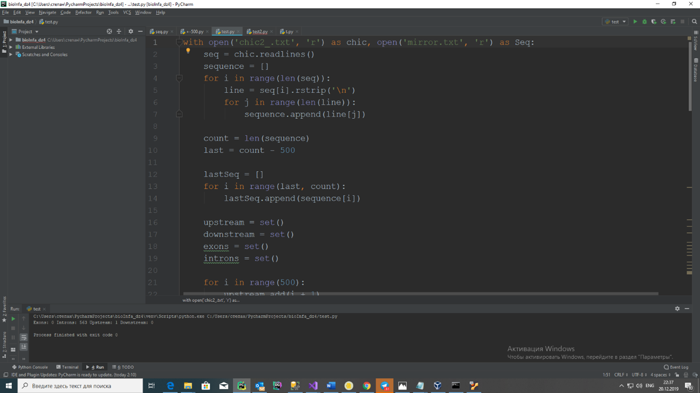
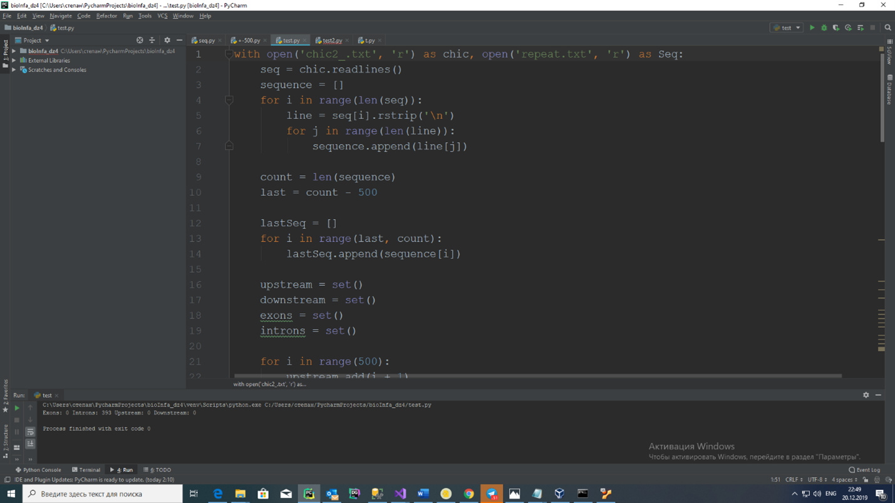
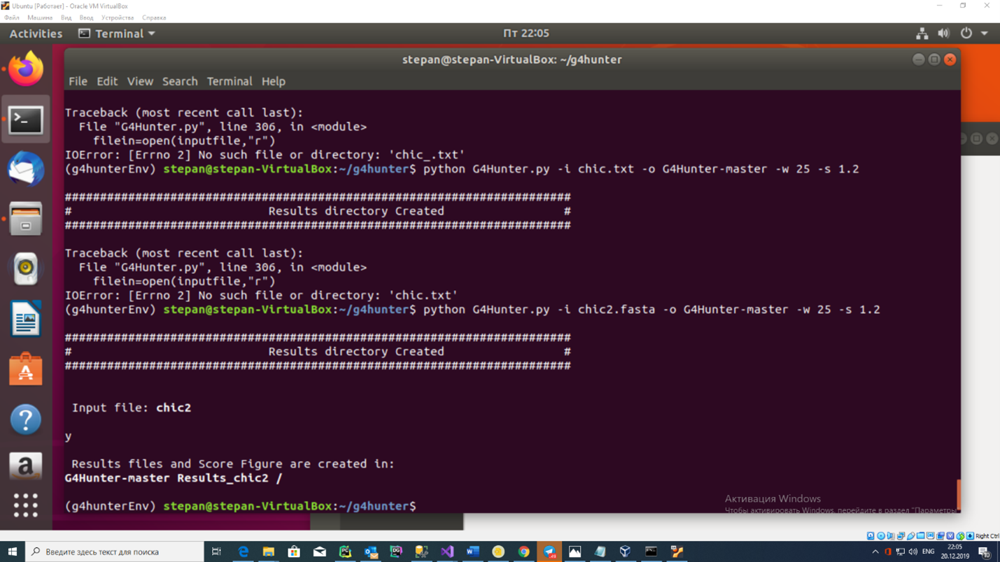
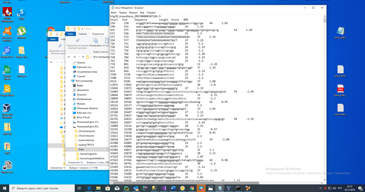
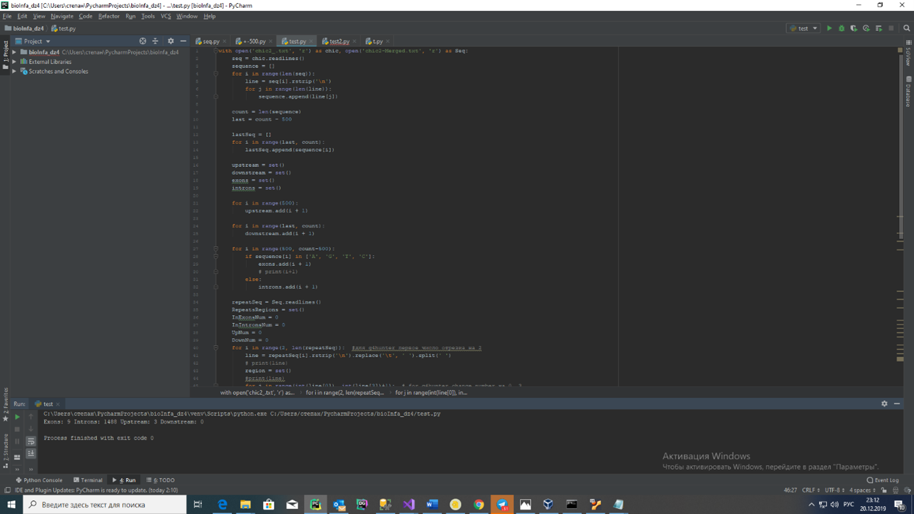

# non-B DNA Motif analysis
**Анализ вторичных структур покажет наиболее частые места локации различных вторичных структур онкогена CHIC2**
> Полное название: cysteine-rich hydrophobic domain 2

Этот ген кодирует член семейства белков CHIC. Кодируемый белок содержит богатый цистеином гидрофобный (CHIC) мотив и локализуется в везикулярных структурах и плазматической мембране. Этот ген связан с некоторыми случаями острого миелоидного лейкоза.
1)	Скачиваю ген и его окрестности +-500:

  

2)	После того, как я прогнал полученную из Table Browser последовательность в https://nonb-abcc.ncifcrf.gov/apps/nBMST/default/, я написал скрипт для сегментации полученных повторов, Z-DNA и т.п. на количество этих структур в интронах, экзонах, +-500 окрестностях гена. (Скрипт приложу к файлу, изначально в Table Browser задал, что экзоны в верхнем регистре. За счёт чего и провёл сегментацию. Скрипт учитывает возможность пересечения структур на областях)

 

 

 

 
 

3)	Потом установил G4Hunter и провёл анализ онкогена на структуры квадруплексов (их количество)
Полученный текстовый файл так же прогнал через скрипт:
 

 

	G4	Inverted Repeat	Mirror Repeat	Direct Repeat	Z-DNA	Short Tandem Repeat
500 пар оснований до начала гена	3	1	1	0	0	1
экзоны	9	4	0	0	0	3
интроны	1488	1924	563	393	118	942
500 пар оснований после окончания гена	0	0	0	0	0	0
 

По итогу исследования можно сделать выводы, что данные вторичные структуры ДНК чаще всего находятся в зонах интронов. Следовательно их появление преимущественно в данных областях говорит о том, что они были созданы чаще всего в ходе репликации генома или под влиянием транспозонов.

В PubMed упоминаний о вторичных структурах данных онкогена не обнаружил.

